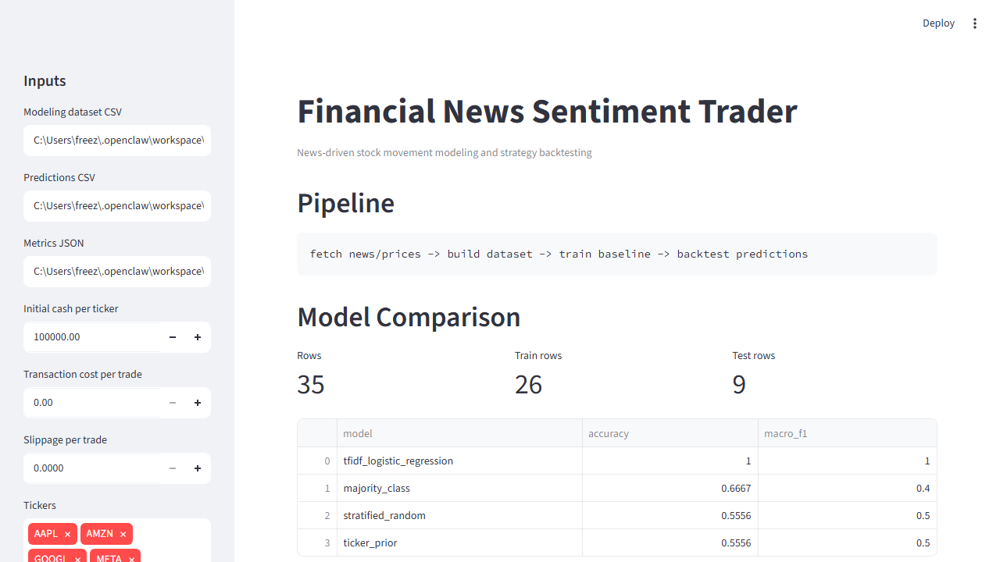

# Financial News Sentiment Trader

AI stocks class project: a Python machine learning pipeline that analyzes financial news, predicts next-day stock movement, and backtests trading strategies against market benchmarks.

## Project goal

Use financial news headlines/summaries to estimate market sentiment, convert that signal into trading decisions, and evaluate whether the strategy performs better than simple benchmarks.

## Dashboard preview



## Planned pipeline

1. Collect financial news by ticker/date.
2. Collect historical stock prices.
3. Clean and normalize article text.
4. Generate labels from future price movement, not same-day movement.
5. Train baseline NLP models.
6. Add finance-specific sentiment modeling, such as FinBERT.
7. Backtest strategy with realistic assumptions.
8. Visualize model results, trades, and benchmark comparison.

## Current foundation

This repo currently includes:

- Python package structure under `src/trading_sentiment`
- Typed domain models for news articles, price bars, signals, trades, and portfolio state
- Text-cleaning utilities
- News CSV ingestion
- Recent Yahoo Finance news ingestion through `yfinance`
- Flexible historical news CSV importer for Kaggle/manual/vendor datasets
- Yahoo Finance price ingestion through `yfinance`
- Dataset builder that joins news and prices by ticker/date
- Future-return labeling logic
- Baseline TF-IDF + logistic regression model training and evaluation
- Basic trading signal generation
- Minimal long/cash backtesting engine for baseline predictions
- SQLite-compatible app database schema for securities, prices, news, signals, plans, trades, and portfolio snapshots
- Local database initializer command for creating/updating the app database
- Simple Streamlit dashboard for inspecting datasets, predictions, and backtests
- CLI command: `trading-sentiment`
- Unit tests for the core logic
- Project roadmap and architecture notes

## Quick start

From the repository root:

```bash
py -m venv .venv
.venv\Scripts\activate
pip install -e .[dev]
py -m pytest
py -m ruff check .
```

If you do not want to create a virtual environment yet, you can run it with your existing Python install:

```bash
py -m pip install -e .[dev]
py -m pytest
```

## Run the current data pipeline

### 1. Initialize the local app database

```bash
py -m trading_sentiment.cli init-db
```

This creates or updates `data/app/trading_sentiment.sqlite` from `database/schema.sql` and seeds `FXAIX` as the first tracked security.

### 2. Build a modeling dataset from the included sample files

The included sample files are intentionally small, so the dashboard will only show a couple of tickers until you import larger news and price datasets.

```bash
trading-sentiment build-dataset --news data/raw/sample_news.csv --prices data/raw/sample_prices.csv --output data/processed/sample_modeling_dataset.csv
```

Equivalent module form:

```bash
py -m trading_sentiment.cli build-dataset --news data/raw/sample_news.csv --prices data/raw/sample_prices.csv --output data/processed/sample_modeling_dataset.csv
```

This creates a processed CSV with:

- aggregated news per ticker/date
- combined article text
- cleaned model-ready text
- stock OHLCV price fields
- future close price
- future return
- movement label: `1`, `0`, or `-1`

For a richer local dashboard demo, use the committed multi-ticker demo files:

```bash
py -m trading_sentiment.cli build-dataset --news data/raw/demo_news.csv --prices data/raw/demo_prices.csv --output data/processed/demo_modeling_dataset.csv
py -m trading_sentiment.cli train-baseline --dataset data/processed/demo_modeling_dataset.csv --metrics-output reports/demo_baseline_metrics.json --predictions-output reports/demo_baseline_predictions.csv
py -m trading_sentiment.cli backtest-predictions --predictions reports/demo_baseline_predictions.csv --summary-output reports/demo_backtest_summary.csv --trades-output reports/demo_backtest_trades.csv --equity-output reports/demo_backtest_equity_curve.csv --transaction-cost 1.00 --slippage-pct 0.001
```

See [`reports/SAMPLE_RESULTS.md`](reports/SAMPLE_RESULTS.md) for the committed demo metrics and backtest summary.

### 3. Fetch recent real financial news

```bash
trading-sentiment fetch-news --tickers AAPL,MSFT,NVDA --max-articles-per-ticker 25 --output data/raw/news.csv
```

Equivalent module form:

```bash
py -m trading_sentiment.cli fetch-news --tickers AAPL,MSFT,NVDA --max-articles-per-ticker 25 --output data/raw/news.csv
```

Note: Yahoo Finance's free news endpoint is recent-news oriented. For deeper historical backtesting, this project will eventually need a historical news provider or archived dataset.

### 4. Import historical news from a CSV dataset

For large Kaggle/manual/vendor datasets, stream and normalize a filtered subset into this project’s news schema:

```bash
py -m trading_sentiment.cli prepare-historical-news --input downloads/historical_news.csv --output data/raw/news.csv --ticker-column ticker --date-column date --title-column title --summary-column summary --source-name kaggle --tickers AAPL,MSFT,NVDA --max-rows 50000
```

If your source columns have different names, map them explicitly:

```bash
py -m trading_sentiment.cli prepare-historical-news --input downloads/historical_news.csv --output data/raw/news.csv --ticker-column symbol --date-column published_at --title-column headline --summary-column body --source-column publisher --url-column url --source-name kaggle --tickers AAPL,MSFT,NVDA --chunk-size 100000 --max-rows 50000
```

For very large direct-download CSVs, sample bounded HTTP byte ranges without downloading the full file:

```bash
py -m trading_sentiment.cli sample-remote-news --url https://huggingface.co/datasets/Zihan1004/FNSPID/resolve/main/Stock_news/nasdaq_exteral_data.csv --output data/raw/fnspid_sample_news.csv --ticker-column Stock_symbol --date-column Date --title-column Article_title --summary-column Lsa_summary --source-column Publisher --url-column Url --source-name FNSPID --tickers AAPL,MSFT,NVDA --range-bytes 25000000 --max-ranges 20 --max-rows 5000 --min-rows-per-ticker 1000
```

Use `--min-rows-per-ticker` when you want the sampler to keep scanning byte ranges until each requested ticker has enough rows, instead of stopping after the first matching ranges fill the global row cap.

For small CSVs, `import-news-csv` is also available and loads the full file at once.

See [`data/DATASETS.md`](data/DATASETS.md) for dataset rules, schemas, and quality checks.

### 5. Fetch real historical prices

```bash
trading-sentiment fetch-prices --tickers AAPL,MSFT,NVDA --start 2024-01-01 --end 2024-03-01 --output data/raw/prices.csv
```

### 6. Build a real modeling dataset

After collecting `data/raw/news.csv` and `data/raw/prices.csv`:

```bash
trading-sentiment build-dataset --news data/raw/news.csv --prices data/raw/prices.csv --output data/processed/modeling_dataset.csv
```

### 7. Train the baseline ML model

```bash
trading-sentiment train-baseline --dataset data/processed/modeling_dataset.csv --metrics-output reports/baseline_metrics.json --predictions-output reports/baseline_predictions.csv --model-output models/baseline_model.joblib
```

Equivalent module form:

```bash
py -m trading_sentiment.cli train-baseline --dataset data/processed/modeling_dataset.csv --metrics-output reports/baseline_metrics.json --predictions-output reports/baseline_predictions.csv --model-output models/baseline_model.joblib
```

This trains an explainable baseline:

- TF-IDF text features from `cleaned_text`
- Logistic regression classifier
- Chronological train/test split to better mimic future prediction
- JSON metrics with naive comparisons: majority class, stratified random, and ticker prior
- Held-out prediction CSV artifacts

### 8. Backtest baseline predictions

```bash
trading-sentiment backtest-predictions --predictions reports/baseline_predictions.csv --summary-output reports/backtest_summary.csv --trades-output reports/backtest_trades.csv --equity-output reports/backtest_equity_curve.csv --transaction-cost 1.00 --slippage-pct 0.001
```

Equivalent module form:

```bash
py -m trading_sentiment.cli backtest-predictions --predictions reports/baseline_predictions.csv --summary-output reports/backtest_summary.csv --trades-output reports/backtest_trades.csv --equity-output reports/backtest_equity_curve.csv --transaction-cost 1.00 --slippage-pct 0.001
```

This converts predicted labels into a simple long/cash strategy per ticker:

- `1` → buy / stay long
- `0` → hold current position
- `-1` → sell / stay cash

Use `--transaction-cost` for fixed per-trade fees and `--slippage-pct` for price impact as a decimal, such as `0.001` for 0.1% worse execution on buys and sells.

The summary report includes strategy return, buy-and-hold return, excess return, trade count, completed-trade win/loss metrics, exposure, daily win rate, max drawdown, volatility, and a Sharpe-like risk metric. The trade report annotates realized P/L on sell rows, and the equity curve report supports charting strategy value over time.

### 9. Run the simple dashboard

```bash
py -m streamlit run src/trading_sentiment/app.py
```

The dashboard shows model-vs-naive metrics, ticker filters, the processed dataset, baseline predictions, strategy summary, equity curve, and trade log.

To inspect the committed demo artifacts in the dashboard, set the sidebar paths to:

- Modeling dataset CSV: `data/processed/demo_modeling_dataset.csv`
- Predictions CSV: `reports/demo_baseline_predictions.csv`
- Metrics JSON: `reports/demo_baseline_metrics.json`

## Architecture diagram

See [`docs/ARCHITECTURE.md`](docs/ARCHITECTURE.md) for the current software architecture and data-flow diagram.

## News CSV format

The dataset builder accepts this normalized news format:

```csv
ticker,published_date,title,summary,source,url
AAPL,2024-01-02,Apple shares rise after services growth,Analysts noted stronger demand,sample,https://example.com/article
```

Required columns: `ticker`, `published_date`, `title`.
Optional columns: `summary`, `source`, `url`.

## Disclaimer

This is an educational software project, not financial advice or a production trading system.
