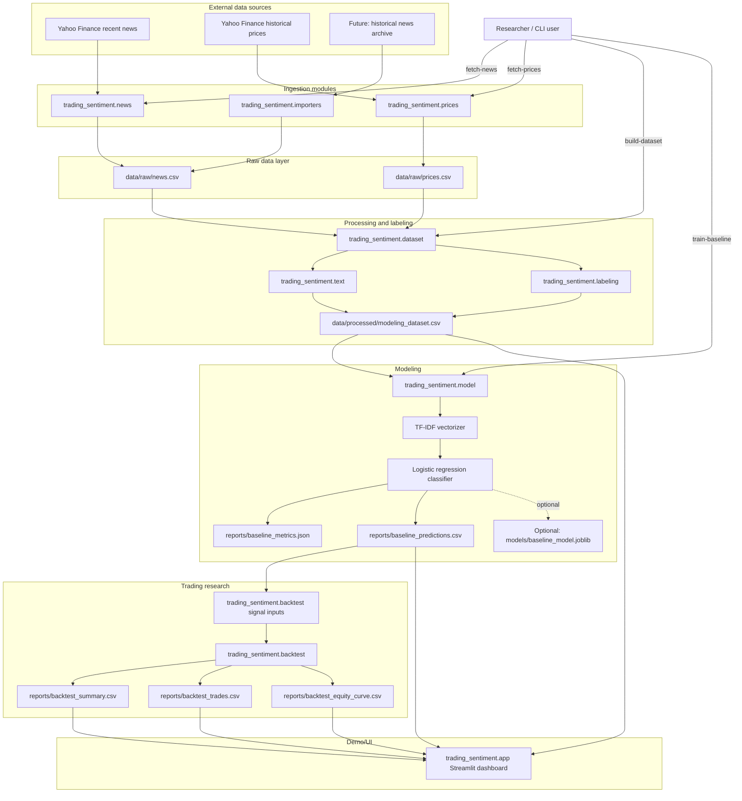

# Software Architecture

Financial News Sentiment Trader is a local Python research pipeline for turning market news into labeled machine-learning rows, training a baseline text classifier, and later backtesting trading signals.

## Current components

- `trading_sentiment.cli` exposes the workflow as commands: fetch news, fetch prices, build dataset, and train baseline.
- `trading_sentiment.news` loads already-normalized article data and fetches recent Yahoo Finance news.
- `trading_sentiment.importers` maps arbitrary historical-news CSV columns into the normalized project news schema, including a chunked `prepare-historical-news` path for large local/remote CSVs.
- `trading_sentiment.prices` normalizes OHLCV price history by ticker/date.
- `trading_sentiment.dataset` joins daily news with same-day prices and future close prices.
- `trading_sentiment.labeling` creates the target label from future returns, not same-day movement.
- `trading_sentiment.text` cleans article text for NLP features.
- `trading_sentiment.model` trains the baseline `TF-IDF -> LogisticRegression` classifier and writes evaluation artifacts.
- `trading_sentiment.backtest` converts predicted labels into simple per-ticker long/cash strategy tests with fixed transaction costs and slippage, then reports return, drawdown, exposure, volatility, Sharpe-like risk, trade logs, and equity curves.
- `trading_sentiment.app` provides a simple Streamlit dashboard for inspecting datasets, predictions, and backtest outputs.

## Data flow

1. Fetch recent news or import historical news into `data/raw/news.csv`.
2. Fetch prices into `data/raw/prices.csv`.
3. Build `data/processed/modeling_dataset.csv` by aligning ticker/date rows.
4. Clean and combine article text into `cleaned_text`.
5. Label each row using future price movement: `1` up, `0` neutral, `-1` down.
6. Train the baseline model using a chronological train/test split.
7. Write metrics and held-out predictions under `reports/`.
8. Convert predicted labels into buy/hold/sell signals and backtest them per ticker with optional transaction costs and slippage.
9. Inspect datasets, predictions, and strategy results in the Streamlit dashboard.

## Design principles

- Avoid label leakage: labels are based on future close prices while features come from current news text.
- Keep pipeline stages file-backed so each step can be inspected and rerun independently.
- Start with a simple, explainable baseline before adding heavier NLP models like FinBERT.
- Treat Yahoo Finance news as a recent-news source only; serious historical backtesting needs a deeper news archive.
